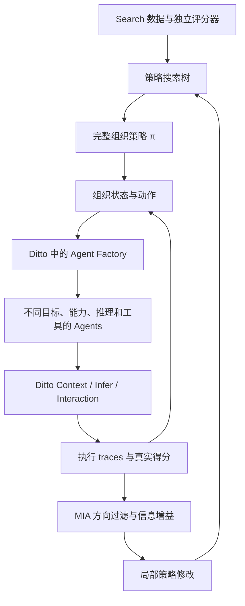

# 实现与研究方案的对应关系

## 边界与依赖

用户要求以已发布 Ditto 包组装 agent，本项目只使用其公开 exports。`package-lock.json` 将 `@codesoul-co/ditto@0.1.1` 锁定到 npm registry 的 tarball 及 integrity。本轮在用户授权下先更新、发布 Ditto，再从 npm registry 安装新版本。本项目依赖和执行始终只通过发布包，不引用源码 checkout。

应用职责：数据/评分、策略 DSL、mutation、MIA、组织状态、agent 配置、证据路由、搜索记录。
Ditto 职责：Context Worker、Infer Worker、Interaction Worker、Graph 调度、推理策略、ReAct 工具流、模型协议与工具调用。

## 数据与评分

`src/data.ts` 读取严格 schema JSONL。自定义数据的 prepare 按 group 洗牌，seed 42，生成互斥 search/confirmation/test 与内容 hash manifest。公开 benchmark 则直接使用锁定的 AFlow validate/test，分别映射为 search/test，不重新抽样或划出 confirmation；读取时校验完整文件 SHA-256。详见 [AFlow 数据协议](aflow-data-protocol.md)。没有通用办法自动检测语义近重复；数据制作者应将共享原题、模板、来源或多变体样本标成同一个 group。

LLM 只收到 `{id,prompt}`，标准答案保留在 evaluator。模型做开放语义工作：提出 deficit、构造 agent、判断已有 capability 是否相关；表现标签来自 exact/numeric、数学等价性或容器代码测试等评分器。MIA 后验仍使用二元指标；AFlow DROP 同时记录原版最大 token F1，但仅 F1=1 记作二元成功，连续 F1 不进入三分类后验。

confirmation 参与多次候选选择，属于验证数据，不能当无偏 test。test 在 `evaluate` 单独加载，运行前检查与策略选择数据的 ID、prompt hash 和 group 不重叠。为了保持上游固定划分，AFlow DROP 的 5 对已锁定 prompt 重复单独放行并记录；不豁免其他重叠。

## 策略与搜索

`src/policy.ts` 的策略是有序规则表。每条 rule 具有 status、guards 和 action，匹配后返回绑定了具体 owner/source 的组织动作。语义目标和工具不进入 mutation grammar。当前没有任意 Python/JavaScript 代码生成或执行。

初始策略只允许 Root CONTINUE/STOP。可搜索 REVIEW、CHALLENGE，以及派生—交付—整合的完整操作，详见 [搜索控制 v2](search-v2.md)。mutation 包括新增状态规则、改 action、增删 guard、优先级、复用顺序、深度 guard 与移除规则；搜索节点保存修改后的完整策略。预算是运行时硬边界，不允许 mutation 提高实验预算。

父节点从已完整评估的候选中选取；当前取 top-k 后以 softmax utility 与均匀探索混合。Root 即使不满足资源均值约束也可作为探索起点，但不满足约束的策略不会导出为 best。

每轮利用 parent trace 的离散 deficit 状态限制合法编辑。`ACTIVE` 加 artifact readiness 对应文档中的 UNROUTED；`DELIVERED` 对应 delivered-unresolved；`RESOLVED` 与 overactive guard 用于失活/停止。运行态不会给 agent 或边附加质量数值。

## Posterior 与 acquisition

`src/mia.ts` 保存三项真实 paired outcome 计数，先验为 Dirichlet(1,1,1)。同一编辑描述按 family、status 和 edit description 分层，在不同父节点间积累。**这包含一个明确建模假设：同层编辑的结果可交换。** 这不是不同父策略上效果相同的保证；严谨实验可进一步按任务域/父策略特征分层。

trigger rate = parent trace 上决策改变的任务数 / search task 总数。posterior Monte Carlo 得到每个可能世界中的最佳编辑，使用 outcome likelihood 对同一批世界重加权来估计 `H(E*) - E[H(E*|O)]`。该方法与对假设 outcome 更新 Dirichlet 后再采样估计的是同一目标，同时减少独立采样造成的负信息增益噪声。

bootstrap 优先低观测数与高 trigger coverage。完成 bootstrap 后使用 acquisition。观测永远来自实际子策略执行；继承的任务不计为新 observation。LLM-guided 对照只选择合法 edit ID，不改变 evaluator。

## Affected set、复用与统计含义

每个 trace 记录动作前的完整策略输入（deficits、活动状态、深度、turns、stalled）。重新运行 child policy，找到决策不同的任务。无分歧任务继承 parent 的那次**已观测轨迹**和评分，记录 `inheritedFrom`；不增加执行次数或 token 消耗。

此结论只对保存的轨迹成立。即使 seed 相同，远端模型也未必确定；不能声称随机 rollout 的整体分布完全不变。启用 prefixCache 后，候选在首个分歧决策前恢复 parent checkpoint，跳过 Root 和已完成的前缀调用；关闭时从头运行。共用前缀减少配对噪声，但 suffix 的模型采样仍可能不同。自定义协议可配置独立 confirmation；AFlow 对齐协议不增设 confirmation。多 seed 科研实验还应重复评估并报告不确定性。

checkpoint 使用 Ditto `checkpointState/restoreState`，包含 population、各 agent 的 episode/inbox/output、deficits、artifacts、edges、检索记录、trace、逻辑成本和下一个决策位置。保存点之前所有 Ditto 调用已结束。恢复校验 task、模型、预算、初始 pool、代码/资源版本，以及新策略在此前 trace 上仍产生相同决策。它恢复本应用的显式状态；不是序列化 live Worker 或 JavaScript generator。

可选 agent cache 使用 Ditto `BranchStore` 保存完整 turn 结果。key 包含 task、完整 agent state、deficits、incoming、模型、limits、资源/实现版本；最多 256 项，FIFO 淘汰。只有完整成功的调用才缓存。实际成本为零，但原逻辑成本占用 episode 额度。Factory/retrieval 不缓存。checkpoint 与 cache 只允许内置纯算术工具；任何未声明隔离协议的外部工具均 fail closed。

继承未受影响结果时保留逻辑成本，actualTokens/actualCalls 记零。恢复前缀的结果计入前缀逻辑成本，actual 字段只计新增 suffix；底层 usage 是实际账本。外部模型的 seed 不保证确定性，所以 cache 是固定样本复用协议，科研实验需单独报告开关并保留无缓存对照。

## Progressive validation 与晋升

受影响任务按确定性 RNG 洗牌，以 batchSize、2×batchSize……扩展。当一个非最终 batch 累计达到至少 3 个净 harm 时提前拒绝。它是明确的资源分配启发式，不是显著性检验。小批次永远不能晋升。

完整受影响集合执行结束后合并未受影响结果，计算平均准确率、平均 tokens、平均峰值 active agents 与最大深度。候选必须优于父节点和 incumbent、满足资源限制；如配置 confirmation，还要完整运行该集且不低于 incumbent 的 confirmation accuracy，才能成为 incumbent。

如果预算中断，候选标记 budget_exhausted 并保存已观察 outcome；不计算完整 utility，不晋升。基础设施/结构化输出错误使实验失败并留档，不能作为错误答案参与优化。

## Ditto 组成的不同 agent

`src/ditto.ts` 为每次 agent turn 构造隔离的 Ditto Runtime，注册 Context/Infer/Interaction Workers。无工具 agent 通过 Context Graph 和 TRAJECTORY 执行；有工具 agent 使用公开 `runReactFlow`，工具由明确的 manifest 限制。开放 profile 可选 cot、long-cot 或 react，配合不同 private context 和工具产生能力差异。

`DERIVE` 先在 Ditto 内调用 Factory，然后用返回的 profile 构造 agent。`REACTIVATE` 使用已有冻结 profile 或任务内 dormant agent。检索是相关/不相关的分类，没有连续价值分。

artifact 由 source 生成，CONNECT 只将相关 artifact 送给 owner，不转发 source 的完整私有上下文。子 agent 声称“解决”不能直接关闭 owner 的 deficit；owner 必须执行并明确确认。DISCONNECT 去掉后续通信关系，不撤回已经收到的证据。

## 生命周期、持久状态与实验协议

standard 搜索、confirmation 和 test 都从固定 profile pool 开始，每题重置 episode。任务内 DORMANT 保留本题私有上下文；跨任务不会泄漏派生 agent 或记忆。SearchConfig 的 protocol 必须是 standard。

infer/evaluate 可显式选择 continual。`src/canonical.ts` 通过 Ditto 的结构化推理压缩程序性经验并选择保留 agent，以一个 `BranchStore` 分支原子提交 profiles、每个 agent 最多 4000 字符的 memory、已见任务来源和最后一次 consolidation 用量。已存在 profile 的原始定义保留，memory 在构造下一任务私有上下文时注入；避免反复拼接旧记忆。失败或无效 agent ID 会 discard。canonical JSON snapshot 绑定 bundle hash，CLI 用原子文件替换保存；新进程可读回。consolidation 不接收 evaluator labels。

此机制持久化的是显式状态。外部数据库、临时文件、远程工具会话仍需要一般资源事务适配器；需求继续保存在 ditto-requirements.md。current standard 搜索不会在候选晋升时修改 pool，避免同时改变策略和初始化状态。

## 预算与成本

Ditto `TokenBudget` 是预留和结算的唯一实现。MFlow 给同一次模型请求在 search/episode 两个额度中同步预留，再使用同一 usage 结算；调用前拒绝不产生实际 provider 调用。所有实际调用包括 Root、Factory、检索、子 agent、编辑选择与 continual consolidation 都带 run/branch/label。失败/缺失用量保守扣留完整 reservation 并记录 unknown，不作为零成本；基础设施失败不进入 correctness 后验。

默认上界估计为 UTF-8 序列化请求字节数 + 最大输出 + 1024 overhead。它是保守启发式，不能覆盖所有 provider 的隐藏 reasoning/protocol token。程序化接入可给 `MeteredProvider` 注入经验证的完整请求 token 上界；否则不宣称物理硬上限。超过 reservation 会使预算关闭并令实验失败。

逻辑 replay 成本会消耗 episode 可行性预算，但不会消耗实际 search budget。实际账本不能再加上 replay 成本。Consolidation 有独立的 episode 额度，使用同一个实际账本；continual summary 的 actualTokens 包含这部分开销。MFlow 的 episode facade 是串行的；并行 episode 应分别创建 scope，不能复用这个 facade 的可变 episode 字段。

## 停止与复现

搜索到 maxIterations、执行/耗费预算上限、grammar exhausted 时停止。信息饱和只在当前唯一可继续扩展的父节点完成 bootstrap、utility 稳定且最大 EIG 小于阈值时触发；多个未探索父节点时不据局部 EIG 宣称整体收敛。没有全局最优承诺。

保存 tree、所有真实执行、搜索决策、posterior、usage、utility 曲线与冻结 bundle。当前支持留档和重新启动实验，不支持原地断点续搜。为避免混合实验，CLI 拒绝覆盖已有输出目录。
