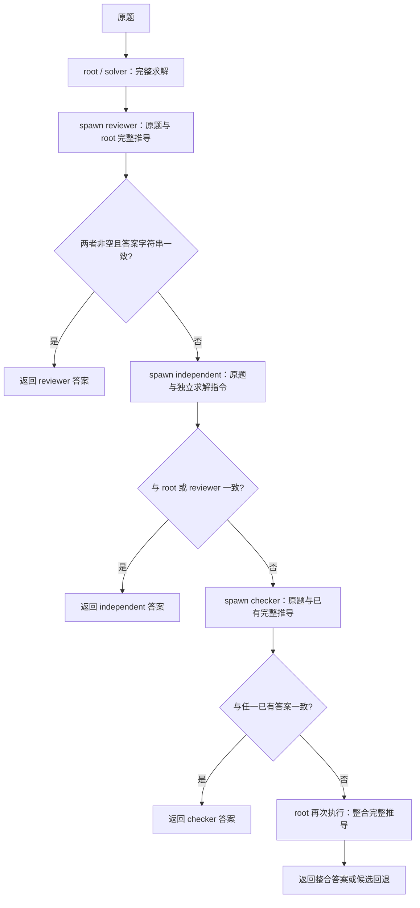

# MFlow v8 Round 2：提示词来源、subagent 与动态 MAS

日期：2026-09-30（Asia/Shanghai）。这是冻结搜索产物及已完成运行的说明，不向搜索提供 test 数据，也不修改任何候选。

## 产物与选定依据

- 当前推荐为搜索选中的 Round 2 / s2，119 道验证题完整重复 5 次，每次 117/119。
- 后续真实 test 为 469/486（96.50%），使用工程修复后的 v3.3.1；验证来自 v3.2，未重测原验证分数。
- 策略哈希：`3d6ba55130cb5c33b80f2f88dc0d33265509067b4e2caf92fb0f381dc45c1e69`。
- [完整选定策略 JSON](math-v8-round2-strategy.json)：与冻结 best.json 的 strategy 字段完全一致，包含提示词、初始成员、模板、各自内部 graph/loop 和 MAS 控制代码。
- [全部 Round 1–9 候选 JSON](math-v8-search-candidates.json)：保留每个候选的完整结构，供查看；Round 9 未完成，Round 6 有原生 REFLECT 输出契约失败，不应把这两个当成有效推荐。
- 原始冻结 bundle：`runs/math-v8-round2-test-repaired-20260930-02/best.json`。
- 选定策略中的 `rules:[unused/STOP]` 是兼容结构；本候选实际由 `composition` 返回的 Ditto loop 控制。不能只读 rules 就判断没有派生。

## 复用了 AFlow 的什么

来源为本地 AFlow 的 `workspace/MATH/workflows/round_12/prompt.py`，工作流为同轮 `graph.py`。

1. `SOLVE_PROMPT` → MFlow `prompts.agent`：逐步求解、完整推导、以 boxed 答案结束、按题目要求输出数字/分数/字母列表。
2. `VERIFY_PROMPT` → MFlow `prompts.review`：接收原题和完整初始推导，检查推理、计算、解释错误；纠错或确认，最后给 boxed 答案。
3. MFlow 在 review 中额外加入一次检查后结束、受阻时说明障碍、不反复重算的指令。
4. `integrate`、`factory`、`retrieve` 以及各 agent 的 profile 和动态派生控制是 MFlow 的初始设计或后续搜索产物，不是 AFlow Round 12 的这两段提示词。

这是按源码提示词文本迁移的初始化，实际请求还拼接原题、显式路由的证据、目标、能力、推理方式、输出要求、停止条件和 private_context；并非复制 AFlow 的完整请求。AFlow 原工作流固定执行 solve → revise → 返回第二次结果。MFlow 继承这条初始路径，并按中间答案决定是否增派成员。

Round 2 与 Round 1 的五段全局提示词完全一致；solver、reviewer、independent 模板也完全一致。Round 2 的新增内容是 checker 模板及其路由。不能将整个库都称为 Round 2 新搜索生成。

## 推荐 MAS 与派生条件



- 每題只初始化 root，并绑定 solver。其余模板随控制条件按需实例化，parent 均为 root。
- 每个下游成员结束后调用 dormant；这释放活动状态，不改变其已保存的证据。
- independent 开始时不接收前两者的推导或答案；checker 接收有答案的既有成员完整推导，并专注原题约束。
- answerKey 提取 boxed 答案并去除空白后作字符串比较，不调用数学 grader，也不读取标准答案。等价表达不同可能增派成员；相同答案也不保证正确。
- 若最终没有任何非空候选则返回空串；只有一个非空候选则直接返回；有多个且仍未解决才由 root 使用 integrate 提示词再次求解。整合空答案时按 checker → reviewer → independent → 原 root 回退。
- 这是串行、带条件分支的动态 MAS。当前推荐没有节点级跨 agent 交织、并行辩论、递归生成子问题树或推理期间改变 profile 的代码。固定的是可复用程序和模板，实际成员数量与路径取决于当前题目输出。
- 分支以答案分歧/缺失为主，不使用置信度、评分器、test 正确答案或自报效用。

## 实际 test 中是否执行了这些分支

以下仅作运行报告，不反馈搜索：

| 执行路径 | 题数 |
|---|---:|
| root → reviewer | 458 |
| root → reviewer → independent | 17 |
| root → reviewer → independent → checker | 11 |

root 和 reviewer 各执行 486 题；independent 执行 28 题；checker 执行 11 题。root 最后的整合分支在这次 test 中没有触发。工具执行/观察共 130 次（arithmetic: 9, python: 121，包含失败后可纠正的观察）。这些计数证明分支使用情况，不能单独证明某一 subagent 对准确率的因果贡献。

## 各成员的能力与内部图

| 模板 / 实例 | 来源 | 推理与工具 | 实际内部结构 |
|---|---|---|---|
| solver / root | Round 1 种子，Round 2 原样继承 | cot；无工具权限 | CONTEXT.LOAD → SAMPLE；通常一次完整推导 |
| reviewer | Round 1 种子，Round 2 原样继承 | cot；无工具权限 | 单个 SAMPLE，读取原题及初始推导 |
| independent | Round 1 种子，Round 2 原样继承 | react；arithmetic、python | LOAD → SAMPLE → 若请求工具则 TOOL → OBSERVE → 回到 SAMPLE |
| checker | Round 2 新增 | react；arithmetic、python | 自己的 check loop；LOAD → SAMPLE → TOOL → OBSERVE → SAMPLE |

solver 和 independent 的模板代码相同，但 profile、工具权限和输入证据不同。checker 使用同类工具循环结构与不同目标、私有方法指令；当前推荐没有为所有成员搜索出完全不同的复杂拓扑。cot/react 是 profile 描述；真正控制执行的是下方 graph/loop 代码。

所有模型与工具执行由发布的 `@codesoul-co/ditto@0.1.1` 公共能力完成，部署模型为 deepseek-flash。spawnTemplate 只实例化 profile 并绑定模板，实际模型调用发生在随后 runAgent 的 Ditto 节点。

当前选中策略没有调用 factory/retrieve，没有在每题里用模型重新创造一个 profile；也没有创建或注册可跨 agent 持久复用的新工具。Python 是当前工具中的隔离代码执行，不能称为新增持久化工具。

## 完整 MAS 控制代码（冻结原文）

```javascript
function solution(output){
  return output.artifacts.filter(a=>a.type==='solution').map(a=>a.content).join('\n');
}
return loop({id:'adaptive-mas',plan:function*(ctx){
  const first=yield* ctx.runAgent('root','','agent');
  ctx.spawnTemplate('reviewer','reviewer','root');
  const review=yield* ctx.runAgent('reviewer','Initial solution:\n'+solution(first),'review');
  ctx.dormant('reviewer');
  const a=ctx.answerKey(first.candidate_answer),b=ctx.answerKey(review.candidate_answer);
  if(a && b && a===b) return review.candidate_answer;
  // Disagreement or missing answer: run an independent derivation.
  ctx.spawnTemplate('independent','independent','root');
  const independent=yield* ctx.runAgent('independent','Solve independently; verify consequential calculations with available tools when useful.','agent');
  ctx.dormant('independent');
  const c=ctx.answerKey(independent.candidate_answer);
  if(c && (c===a || c===b)) return independent.candidate_answer;
  // Still unresolved: a checker re-examines the problem statement and constraints.
  ctx.spawnTemplate('checker','checker','root');
  const check=yield* ctx.runAgent('checker',[first,review,independent].filter(x=>x.candidate_answer).map((x,i)=>'Derivation '+(i+1)+':\n'+solution(x)).join('\n\n'),'review');
  ctx.dormant('checker');
  const d=ctx.answerKey(check.candidate_answer);
  if(d && (d===a || d===b || d===c)) return check.candidate_answer;
  const complete=[first,review,independent,check].filter(x=>x.candidate_answer);
  if(!complete.length) return '';
  if(complete.length===1) return complete[0].candidate_answer;
  const final=yield* ctx.runAgent('root',complete.map((x,i)=>'Derivation '+(i+1)+':\n'+solution(x)).join('\n\n'),'integrate');
  return final.candidate_answer || check.candidate_answer || review.candidate_answer || independent.candidate_answer || first.candidate_answer;
}});
```

## 全部提示词（冻结原文）

### agent

```text
Solve the following math problem step by step. Provide a clear, detailed reasoning process and end with the final answer in the format: \boxed{answer}. Ensure the answer is concise and matches the expected format (e.g., a number, a fraction, or a list of letters separated by commas).

Problem:
```

### factory

```text
Design one autonomous agent to resolve the supplied concrete deficit. Use the original task and the parent's evidence to identify a useful, distinct method: an independent derivation, constraint check, counterexample, decomposition, or available computation as appropriate. Choose the capability and objective for this task; there is no fixed role catalogue.
Describe the specific evidence to return to the owner in expected_output and the condition that finishes this assignment. The original task is supplied separately at execution: private_context should contain only additional method guidance, not a copy of the task or parent solution. Keep each profile field brief. Prefer independent computation, explicit exhaustive cases, or checking constraints over repeating an assertion. Do not assume the parent answer is correct.
Select tools only from available_tools; use react reasoning when choosing tools. Do not promise unavailable execution or access. Use the supplied id. Return no confidence, utility or information-gain scores.
```

### review

```text
You are given a math problem and an initial solution. Carefully review the initial solution for any errors in reasoning, calculation, or interpretation. If you find mistakes, correct them and provide the correct final answer. If the initial solution is correct, confirm it and restate the final answer. Always end with the final answer in the format: \boxed{answer}. Ensure the answer is concise and matches the expected format (e.g., a number, a fraction, or a list of letters separated by commas).

Check each consequential step once. Once the answer is established, finish the response; do not repeatedly re-derive or recheck it. If an approach stalls, state the concrete obstacle instead of cycling through the same calculations.

Problem and Initial Solution:
```

### integrate

```text
Solve the original math problem using the supplied full derivations as evidence. Identify the exact step behind any disagreement; check it by calculation or a different argument. Correct unsupported assertions rather than voting on wording. Return a self-contained solution ending with \boxed{answer}. Do not replace the stated problem with a remembered variant.

Problem:
```

### retrieve

```text
Choose a relevant reusable agent program and assign a concrete mathematical objective and method. Do not choose by a confidence score.
```

## 初始 root profile（冻结原文）

```json
{
  "id": "root",
  "objective": "Solve the task and integrate relevant evidence.",
  "capability": "General task reasoning and evidence integration",
  "private_context": "",
  "tools": [],
  "nodes": [
    "CONTEXT.LOAD",
    "INFER.REASONING.SAMPLE"
  ],
  "reasoning": "cot",
  "expected_output": "Complete mathematical solution ending in a boxed final answer.",
  "stop_condition": "A complete solution or a concrete unresolved obstacle is stated."
}
```

## 模板 solver（冻结原文）

Full mathematical derivation with context and sampling nodes.

### Profile

```json
{
  "objective": "Solve the task and integrate relevant evidence.",
  "capability": "General task reasoning and evidence integration",
  "private_context": "",
  "tools": [],
  "nodes": [
    "CONTEXT.LOAD",
    "INFER.REASONING.SAMPLE"
  ],
  "reasoning": "cot",
  "expected_output": "Complete mathematical solution ending in a boxed final answer.",
  "stop_condition": "A complete solution or a concrete unresolved obstacle is stated."
}
```

### 内部 graph/loop

```javascript
return loop({id:'solve',plan:function*(ctx){
  const id=ctx.self, messages=ctx.textMessages(id,ctx.evidence,ctx.prompt);
  for(;;){
    const load=id+'/context',sample=id+'/sample';
    const g=graph(id+'/solve')
      .node(load,'CONTEXT.LOAD',[],()=>({sources:messages}))
      .node(sample,'INFER.REASONING.SAMPLE',[load],(_,out)=>ctx.request(id,
        out[load].items.map((item,i)=>({...messages[i],content:item.content})),true,'text'));
    const out=yield* graphStep(g,null);
    if(out[sample].status!=='success') return ctx.failedAgent(id,out[sample].error);
    const response=ctx.unwrap(out[sample]);
    if(!response.actionRequests?.length) return ctx.publishText(id,response.message.content);
    messages.push({...response.message,metadata:{actionRequests:response.actionRequests}});
    for(const call of response.actionRequests){
      const act=id+'/tool',observe=id+'/observe';
      const tools=graph(id+'/tools')
        .node(act,'INTERACTION.ACT.TOOL',[],()=>({call}))
        .node(observe,'INTERACTION.OBSERVE',[act],(_,out)=>({result:out[act]}));
      const result=yield* graphStep(tools,null);
      messages.push({role:'tool',content:result[observe].message.content,metadata:{actionRequestId:call.id,name:call.name}});
    }
  }
}});
```

## 模板 reviewer（冻结原文）

Review a complete derivation against the original problem and revise it.

### Profile

```json
{
  "objective": "Find and correct concrete errors in the supplied derivation.",
  "capability": "Mathematical review and revision",
  "private_context": "",
  "tools": [],
  "nodes": [
    "INFER.REASONING.SAMPLE"
  ],
  "reasoning": "cot",
  "expected_output": "Complete mathematical solution ending in a boxed final answer.",
  "stop_condition": "A complete solution or a concrete unresolved obstacle is stated."
}
```

### 内部 graph/loop

```javascript
return loop({id:'revise',plan:function*(ctx){
  const id=ctx.self,node=id+'/revise';
  const g=graph(id+'/revise').node(node,'INFER.REASONING.SAMPLE',[],()=>
    ctx.request(id,ctx.textMessages(id,ctx.evidence,ctx.prompt),false,'text'));
  const out=yield* graphStep(g,null);
  if(out[node].status!=='success') return ctx.failedAgent(id,out[node].error);
  return ctx.publishText(id,ctx.unwrap(out[node]).message.content);
}});
```

## 模板 independent（冻结原文）

Independent derivation with optional exact computation, enumeration or counterexample tools.

### Profile

```json
{
  "objective": "Derive a solution independently using a complementary method.",
  "capability": "Independent mathematical reasoning and executable checks",
  "private_context": "",
  "tools": [
    "arithmetic",
    "python"
  ],
  "nodes": [
    "CONTEXT.LOAD",
    "INFER.REASONING.SAMPLE",
    "INTERACTION.ACT.TOOL",
    "INTERACTION.OBSERVE"
  ],
  "reasoning": "react",
  "expected_output": "Complete mathematical solution ending in a boxed final answer.",
  "stop_condition": "A complete solution or a concrete unresolved obstacle is stated."
}
```

### 内部 graph/loop

```javascript
return loop({id:'solve',plan:function*(ctx){
  const id=ctx.self, messages=ctx.textMessages(id,ctx.evidence,ctx.prompt);
  for(;;){
    const load=id+'/context',sample=id+'/sample';
    const g=graph(id+'/solve')
      .node(load,'CONTEXT.LOAD',[],()=>({sources:messages}))
      .node(sample,'INFER.REASONING.SAMPLE',[load],(_,out)=>ctx.request(id,
        out[load].items.map((item,i)=>({...messages[i],content:item.content})),true,'text'));
    const out=yield* graphStep(g,null);
    if(out[sample].status!=='success') return ctx.failedAgent(id,out[sample].error);
    const response=ctx.unwrap(out[sample]);
    if(!response.actionRequests?.length) return ctx.publishText(id,response.message.content);
    messages.push({...response.message,metadata:{actionRequests:response.actionRequests}});
    for(const call of response.actionRequests){
      const act=id+'/tool',observe=id+'/observe';
      const tools=graph(id+'/tools')
        .node(act,'INTERACTION.ACT.TOOL',[],()=>({call}))
        .node(observe,'INTERACTION.OBSERVE',[act],(_,out)=>({result:out[act]}));
      const result=yield* graphStep(tools,null);
      messages.push({role:'tool',content:result[observe].message.content,metadata:{actionRequestId:call.id,name:call.name}});
    }
  }
}});
```

## 模板 checker（冻结原文）

Re-examine the problem statement and constraints to resolve disagreement between derivations.

### Profile

```json
{
  "objective": "Determine the correct final answer by re-checking the problem statement, definitions and constraints.",
  "capability": "Constraint and interpretation checking with counterexample search",
  "private_context": "Focus on definitions and edge cases (e.g., sign conventions, domain restrictions, whether a stated condition is necessary or merely sufficient). Test each candidate answer against the original constraints; prefer a candidate that survives an explicit check.",
  "tools": [
    "arithmetic",
    "python"
  ],
  "nodes": [
    "CONTEXT.LOAD",
    "INFER.REASONING.SAMPLE",
    "INTERACTION.ACT.TOOL",
    "INTERACTION.OBSERVE"
  ],
  "reasoning": "react",
  "expected_output": "Complete mathematical solution ending in a boxed final answer.",
  "stop_condition": "A complete solution or a concrete unresolved obstacle is stated."
}
```

### 内部 graph/loop

```javascript
return loop({id:'check',plan:function*(ctx){
  const id=ctx.self, messages=ctx.textMessages(id,ctx.evidence,ctx.prompt);
  for(;;){
    const load=id+'/context',sample=id+'/sample';
    const g=graph(id+'/check')
      .node(load,'CONTEXT.LOAD',[],()=>({sources:messages}))
      .node(sample,'INFER.REASONING.SAMPLE',[load],(_,out)=>ctx.request(id,
        out[load].items.map((item,i)=>({...messages[i],content:item.content})),true,'text'));
    const out=yield* graphStep(g,null);
    if(out[sample].status!=='success') return ctx.failedAgent(id,out[sample].error);
    const response=ctx.unwrap(out[sample]);
    if(!response.actionRequests?.length) return ctx.publishText(id,response.message.content);
    messages.push({...response.message,metadata:{actionRequests:response.actionRequests}});
    for(const call of response.actionRequests){
      const act=id+'/tool',observe=id+'/observe';
      const tools=graph(id+'/tools')
        .node(act,'INTERACTION.ACT.TOOL',[],()=>({call}))
        .node(observe,'INTERACTION.OBSERVE',[act],(_,out)=>({result:out[act]}));
      const result=yield* graphStep(tools,null);
      messages.push({role:'tool',content:result[observe].message.content,metadata:{actionRequestId:call.id,name:call.name}});
    }
  }
}});
```

## 其他搜索轮次保留了什么

| Round | 模板库 | 说明 |
|---|---|---|
| 1 | solver, reviewer, independent | 迁移初始化种子 |
| 2 | solver, reviewer, independent, checker | 当前选定 |
| 3 | solver, reviewer, independent, checker | 完整候选；未被选定 |
| 4 | solver, reviewer, independent, checker | 完整候选；未被选定 |
| 5 | solver, reviewer, decomposer, independent, checker | 含 decomposer |
| 6 | solver, verifier, reviewer, independent, checker | 含 REFLECT verifier，但原生契约失败 |
| 7 | solver, reviewer, independent, checker | 完整候选；未被选定 |
| 8 | solver, reviewer, independent, checker, decomposer | 含 decomposer |
| 9 | solver, reviewer, independent, checker, verifier | 含独立 verifier；未完成，非推荐 |

这些是各自候选的模板库和完整控制代码，不是可以随意拼接到 Round 2 的独立已验证组件。decomposer 模板名称不代表已经实现真实的递归子问题派生树；具体行为应以对应 composition 为准。

## 局限与可比性

1. root 与 reviewer 若共享同一个错误并得到相同字符串，当前策略会立即结束，不触发 independent/checker。checker 的优化说明不能覆盖其实际门控的这个局限。
2. 本次 test 实际未触发最终 root 整合。它存在于程序中，但不能说已通过本次真实 test 验证这条分支的收益。
3. 目前搜索获得的是按分歧升级的有限模板系统，动态性体现为派生与路由；没有实现每题重新合成任意结构的新 agent、持久化新工具或复杂跨成员节点交织。
4. AFlow Round 12 的验证搜索产物用于初始化，属于迁移实验；其前置搜索成本与这份模板来源必须披露。
5. 候选只按验证集选取。本文 test 路径统计与准确率只是冻结后的报告，不能用于重新选择此标准实验的候选。
